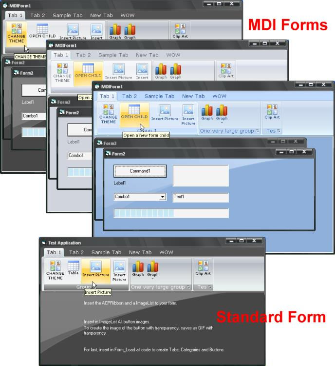



## Ribbon 2007

### Description

(UPDATED 19-Dec-2006) "Ribbon 2007" is a copy of the Ribbon Bar from office 2007. Created using as base the Full project "Office 2007 Ribbon" (http://pscode.com/vb/scripts/ShowCode.asp?txtCodeId=66698&lngWId=1).

THIS ISN&#180;T THE SAME PROJECT! This is only a Ribbon Bar. <b>This version is Finished!</b> With 3 Themes, Black, Blue and Silver. This bersion hasn&#180;t flicker problem that "Office 2007 Ribbon" have.

"Ribbon 2007" don&#180;t substitute "Office 2007 Ribbon", because this is a ribbon only, and the full version is on work, the full version have all of this version and Form Skin, MainMenu, ToolbarMenu, Customize Menu, Status Bar, and more...

For frequently update on "Office 2007 Ribbon", visit original post link above.
 
### More Info
 

             |
---                |---
**Submitted On**   |2006-10-31 11:41:10
**By**             |[Adriano Paladini](https://github.com/Planet-Source-Code/PSCIndex/blob/master/ByAuthor/adriano-paladini.md)
**Level**          |Intermediate
**User Rating**    |5.0 (218 globes from 44 users)
**Compatibility**  |VB 6\.0
**Category**       |[Miscellaneous](https://github.com/Planet-Source-Code/PSCIndex/blob/master/ByCategory/miscellaneous__1-1.md)
**World**          |[Visual Basic](https://github.com/Planet-Source-Code/PSCIndex/blob/master/ByWorld/visual-basic.md)
**Archive File**   |[Ribbon\_20020383512192006\.zip](https://github.com/Planet-Source-Code/adriano-paladini-ribbon-2007__1-66951/archive/master.zip)

